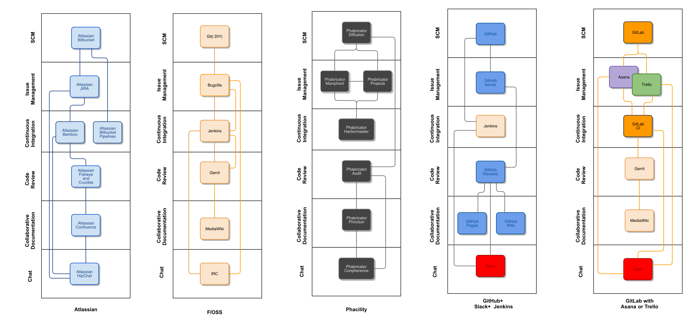

# Tools Roundup Blog (plus)

Markdown and graphics resources for the A9 Tools Rundown Series

Markdown pages contain Markdown tables, generated from the included CSV with 'csvtomd'.

Images are captured with a PDF > PNG workflow in The GIMP.

----

In this blog series, I gave a cursory review of a handful of solutions for SDLC Collaboration in 2016 for:

- Connecting PMO and Concept to Operational Support

- Connect Quality Assurance to Engineering with continuous integration

- Provide visibility with Chat ops and the feedback loops between these distinct, interconnected disciplines

We presented tools from Atlassian, Trello, Phabricator, Asana, GitHub and GitLab, as well as some Free and Open Source options.

Where possible, we highlighted options to avoid lock-in, reduce costs or introduce 'hybrid vigor'. Combining vendors tools, drawing together their strengths together.

This was not meant to be comprehensive or representative of every option, though the general outcomes are the same:

- Workflows can align to ITSM and Scaled Agile guidelines
- The solutions provide the flexibility to many of the the phases of common development methodologies
- Tools like Google Docs, Microsoft Excel and other office monoliths are not featured

This is a recap.

## Essential Components

The well-integrated collaboration solution combines key components:

### Distributed Source Code Management

A distributed version control system (DVCS) is the central asset repository.

[Popular DVCS](https://www.openhub.net/repositories/compare) options Git, Subversion, Mercurial are represented.

Services offering a remote repository are shown, as well as a "Do it yourself" Git service.

           |  Plugins  |  Integrations  |  Chat integration  |  Issues integration  |  Cost/10 users/mo  |  SaaS  |                                   
-----------|-----------|----------------|--------------------|--------------------|--------------------|--------|-----------------------------------
Github     |  y        |  y             |  y                 |  y                 |  208.3333333       |  y     |  part of github enterprise        
GitLab     |  n        |  y             |  y                 |  y                 |  0                 |  a     |  Free/Optional $199.80 support fee
DIY Git    |  n        |  y             |  y                 |  n                 |  0                 |  n     |                                   
Bitbucket  |  n        |  y             |  y                 |  y                 |  10                |  a     |                                   
Gitbucket  |  y        |  y             |  y                 |  y                 |  0                 |  n     |                                   
Diffusion  |  y        |  y             |  y                 |  y                 |  200                 |  y     | SaaS offering is cited                                  

----
### Issue Tracking

During the last twenty years, we have worked with many solutions. Each example serves the same purpose:

- Give an issue a unique ID

- Timestamp for creation and resolution

- An owner and some means of transition .

With the introduction of Agile, Kanban and Scrum, the tracking tool has taken on new visibility and importance. Growing in exposure and visibility, it has become the p3imary integration point - The Hub.

                 |  Plugins  |  API  |  Wiki Integrations  |  Chat integration  |  DVCS integration  |  Cost/10 users/mo  |  SaaS  |  Note                                                  
-----------------|-----------|-------|---------------------|--------------------|--------------------|--------------------|--------|--------------------------------------------------------
JIRA             |  y        |  y    |  y                  |  y                 |  y                 |  10                |  a     |                                                        
Trello           |  n        |  y    |  na                 |  y                 |  y                 |  99.9              |  y     |                                                        
Asana            |  y        |  y    |  na                 |  y                 |  n                 |  83.3              |  y     |                                                        
Bugzilla         |  n        |  n    |  na                 |  y                 |  y                 |  0                 |  n     |                                                        
Basecamp         |  y        |  y    |  na                 |  y                 |  n                 |  99*               |  y     |  Flat fee/unlimited users/monthly                      
Request Tracker  |  y        |  y    |  diy                |  diy               |  diy               |  0                 |  n     |                                                        
Maniphest        |  n        |  y    |  y                  |  y*                |  y                 |  200               |  a     |  Part of Phabricator license, one license for all tools
Projects         |  n        |  y    |  y                  |  y*                |  y                 |  200               |  a     |  Part of Phabricator license, one license for all tools
Gitlab           |  y        |  y    |  y                  |  y                 |  y                 |  0                 |  a     |  Free/Optional $199.80 support fee                     
Github Issues    |  n        |  y    |  y                  |  y                 |  y                 |  208.3333333       |  y     |  part of github enterprise                             

----
### Collaborative Documentation

Documentation is critical to the modern workplace. Used as operational support, system of record and internal communication.

The collaborative documentation tool replaces static single-user documents with an online, live, multi-user experience.

Integrations with tools throughout the stack incorporate data and outcomes from those phases.

              |  Plugins  |  Integrations  |  Chat integration  |  DVCS integration  |  Cost/10 users/mo  |  SaaS  |  Note                                                    |             
--------------|-----------|----------------|--------------------|--------------------|--------------------|--------|----------------------------------------------------------|-------------
Confluence    |  y        |  y             |  y                 |  y                 |  10                |  y     |                                                          |             
MediaWiki     |  n        |  y             |  y                 |  y                 |  0                 |  y     |                                                          |             
Phriction     |  y        |  y             |  y                 |  y                 |  200               |  a     |  Part of Phabricator license, one license for all tools  |             
GitHub Pages  |  n        |  n             |  n                 |  y                 |  208.3333333       |  y     |  Part of Github Enterprise                               |             
GitHub Wiki   |  n        |  n             |  n                 |  n                 |  208.3333333       |  y     |  Part of Github Enterprise                               |             
GitLab Pages  |  y        |  y             |  y                 |  y                 |  0                 |  a     |  Free/Optional $199.80 support fee                       |  Not WYSIWYG

----
### Automation/Continuous Integration

The well-connected solution exhibits some level of automation:

- Build or test procedures initiated by transition change

- Triggers by external systems, or some other repeatable process

Continuous Integration/Continuous Deployment drives build automation and code deployments.

Known as 'CI/CD', it reduces risk through automation. Enhancing visibility with an audit trail with direct ties to associated commits and reviews.

                    |  Plugins  |  Integrations  |  Issue Tracker Integrations  |  Chat integration  |  DVCS integration  |  Cost/10 users/mo  |  SaaS  |                                                        
--------------------|-----------|----------------|------------------------------|--------------------|--------------------|--------------------|--------|--------------------------------------------------------
Jenkins             |  y        |  y             |  y                           |  y                 |  y                 |  0                 |  n     |                                                        
Jenkins Enterprise  |  n        |  y             |  y                           |  y                 |  y                 |  ?                 |  y     |  Contact for price                                     
Gitlab              |  ?        |  y             |  y                           |  y                 |  y                 |  0                 |  a     |  Free/Optional $199.80 support fee                     
CircleCI            |  y        |  y             |  y                           |  y                 |  y                 |  50                |  y     |  2 containers                                          
Travis              |  y        |  y             |  y                           |  y                 |  y                 |  129               |  y     |  2 jobs/unlimited users                                
Harbormaster        |  y        |  y             |  y                           |  y                 |  y                 |  200               |  a     |  Part of Phabricator license, one license for all tools
Bamboo              |  y        |  y             |  y                           |  y                 |  y                 |  10                |  a     |                                                        

----
### Review

The example solutions integrate a review phase and software component to execute it. Teams gain a facility to analyze and comment on code or components - a critical step of the continuous integration feedback loop.

Review processes may integrate an issue or provide direction at the development of acceptance. Outcomes may define what documentation is written, or how it is used.

          |  Plugins  |  Integrations  |  Atlassian Integrations  |  Chat integration  |  DVCS integration  |  Cost/10 users/mo  |  SaaS  |                                                        
----------|-----------|----------------|--------------------------|--------------------|--------------------|--------------------|--------|--------------------------------------------------------
Crucible  |  y        |  y             |  y                       |  y                 |  y                 |  83.33333333       |  y     |  $1000 one time payment                                
Gerrit    |  n        |  y             |  y                       |  y                 |  y                 |                    |  y     |                                                        
Audit     |  n        |  y             |  y                       |  y                 |  n                 |  200               |  a     |  Part of Phabricator license, one license for all tools
Gitlab    |  n        |  y             |  y                       |  y                 |  y                 |  0                 |  a     |  Free/Optional $199.80 support fee                     
GitHub    |  n        |  y             |  y                       |  y                 |  y                 |  208.3333333       |  y     |  Part of github enterprise                             

----
### Chat

The "Chatops" concept is a recent moniker to describe a proven concept. It institutionalizes the notion that teams work together more effectively when 'chat' is an approved communication channel.

In essence, chatops is a minimally-intrusive conduit to intra-personal communication. Chat offers a collective stream-of-consciousness across teams, business units and disciplines. Less formal than email and less demanding than a coordinated conference.

             |  Plugins  |  REST  |  Bots  |  Issue integration  |  DVCS integration  |  Cost/10 users/mo  |  SaaS  |  Note                                                  
-------------|-----------|--------|--------|---------------------|--------------------|--------------------|--------|--------------------------------------------------------
HipChat      |  y        |  y     |  y     |  y                  |  y                 |  10                |  a     |  AWS or hosted only                                    
IRC          |  n        |  y     |  y     |  y                  |  y                 |  0                 |  a     |                                                        
Conpherence  |  n        |  y     |  n     |  y                  |  y                 |  200               |  a     |  Part of Phabricator license, one license for all tools
XMPP         |  n        |  y     |  y     |  y                  |  y                 |  0                 |  n     |                                                        
Slack        |  n        |  y     |  y     |  y                  |  y                 |  60                |  y     |                                                        
Mattermost   |  y        |  y     |  y     |  y                  |  y                 |  0                 |  n     |  Open Source                                           
----

## Other things to consider

When considering implementation strategies for these and other tools, infrastructure is an inescapable reality. Cloud and SaaS options abound, with Managed Services filling the gap.

Raw data on financial impact isn't available in all cases, and can be nullified by individual circumstances.

We know these illustrations will not address all teams or scenarios. Some technologies are not a focus for us and were omitted; Perforce, Visual Studio and the Rational portfolio, among others.

Operational reliability, geographic availability and licensing options are topics for future posts in this series.

----
