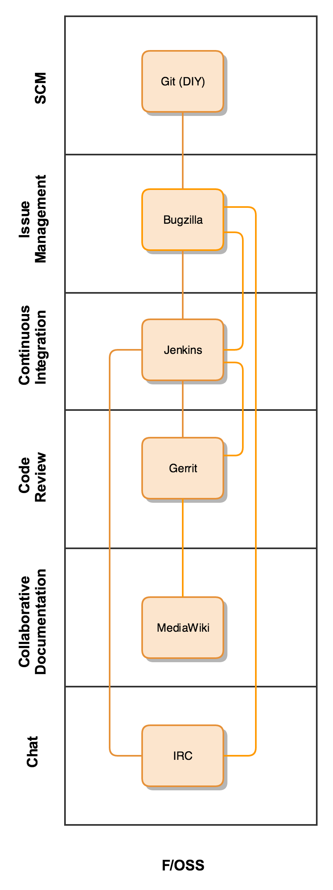

#2016 Tools Rundown - F/OSS

In this post, we will take a look at an integrated collaboration tools stack using a variety of Free Software tools.

### Distributed Source Code Management

F/OSS DVCS options are many. Popular and widely-used tools like Subversion, Mercurial, Git, Bazaar are available and used by large and small teams across the globe.

Git has overtaken Subversion (svn) as the distributed version control system of choice, offering distributed teams the ability to contribute and collaborate on common code bases. Written by Linus Torvalds, git is the version control system used by not only the Linux kernel, but also Linux distributions running a majority of the systems on the Internet.

It is well understood, and offers the key features of branching, reversion, merging as well as 'blame', for isolating individual contributions or contributors.

F/OSS interfaces which mimic many of the popular features of GitHub are available for consumption as a service, or for implementation on-premise. GitBucket, Gitlab and other offerings are available under popular OSS licenses.

----
### Issue Tracking

There are a number of F/OSS issue tracking tools available. This article is concerned with one primarily; Bugzilla.

Arguably the oldest and most mature bug reporting tool in this category, Bugzilla powers the development of many other F/OSS tools, including Bugzilla itself.

Request Tracker, or R/T is another long-lived OSS product. Its modular nature is developer-friendly and uses the powerful and popular Perl language to achieve a high level of configurability and powerful data access.

----
### Collaborative Documentation

As the largest, most widely used collaboration platform on Earth, the Mediawiki Foundation's 'Wikipedia' product is well-known, and offers a familiar interface for the creation and access of a broad variety of content, including images, LaTeX, diagrams, code and other types of information.

----
### Automation

Jenkins appears in this example, as it is F/OSS software, and powerful and well-regarded as a CI/CD and Automation engine for mission-critical projects.

Git integrations are well-studied and [implemented in Jenkins](https://wiki.jenkins-ci.org/display/JENKINS/GitHub+Plugin) through a variety of Plugins. Triggers, automated branching and release tagging are available,

Jenkins can run behind the firewall, or the cloud-hosted CloudBees Jenkins service can be leveraged.

----
### Review

Gerrit's code review is featured in this example. A F/OSS project, Gerrit is used by the WMF to review the large, collaboratively developed codebase of Wikipedia.

Readily connected to git or subversion repositories, Gerrit provides a team review facility for individual commits, merges and delivers attribution through a bare-bones interface.

----
### Chat

F/OSS Chat means "Internet Relay Chat", or "IRC". The original collaborative chat tool. IRC remains in use today by hundreds of organizations. Extensible through the use of Bots, IRC delivers a powerful interface to real-time events and conversation.

----

## Other things to consider

Adherence to the spirit of difference Open Source licenses may still be a complexity foreign to many organizations, and is often a barrier to adoption.

The important factor is that customizations and one-off enhancements may or may not be subject to the requirements of upstream contribution.

----

