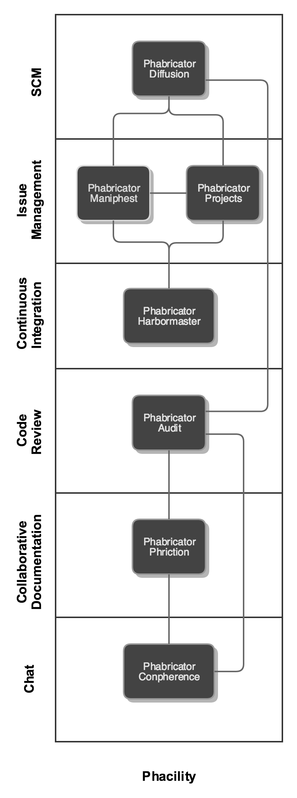

#2016 Tools Rundown - Phacility

This post illustrates the all-in-one collab suite from Phacility; Phabricator and friends.

### Distributed Source Code Management

Diffusion offers similar git access to most of the other tools reviewed in this series.
Notable features of Diffusion are:

- Cluster capability (prototype only)
- Create repositories in the web ui
- Tight, OOTB integration with other Phabricator tools
- Support for Git, Subversion & Mercurial

----
### Issue Tracking

Projects and Maniphest provide a basic tool for tracking issues and effort. More limited than JIRA or Asana in this regard, "Projects" and "Maniphest" deliver action items and to dos with a minimal 'program level' overview.

Issue ownership, status, and transitions are basic, but integrate well with other Phacility components.

----
### Collaborative Documentation

Phriction offers a basic documentation collaboration environment using "[Remarkup](https://secure.phabricator.com/book/phabricator/article/remarkup/)", a "lightweight" markup language.

Phriction supports extension through plugins, but lacks the diversity of other platforms.

----
### Automation

Harbormaster offers event-driven automation backed by repositories in Diffusion and issue states in Maniphest.

----
### Review

Audit provides a review facility integrated with the issues and documentatino presented in other components. It is a lightweight alternative to a tool like Gerrit or Fisheye.

----
### Chat

Conpherence gives users a realtime web-based chat interface.

---

## Other things to consider

Everything is under one roof.

Tailored to the needs of software development teams.

----
